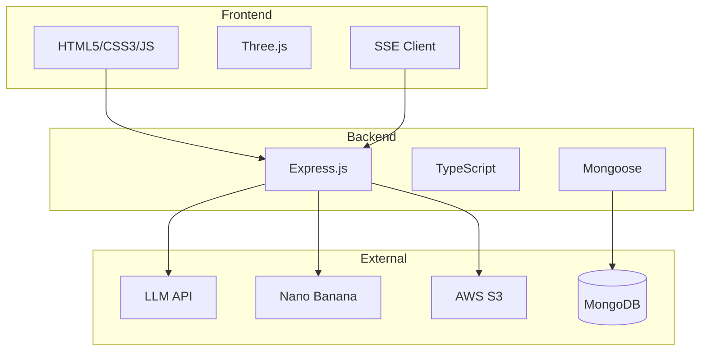
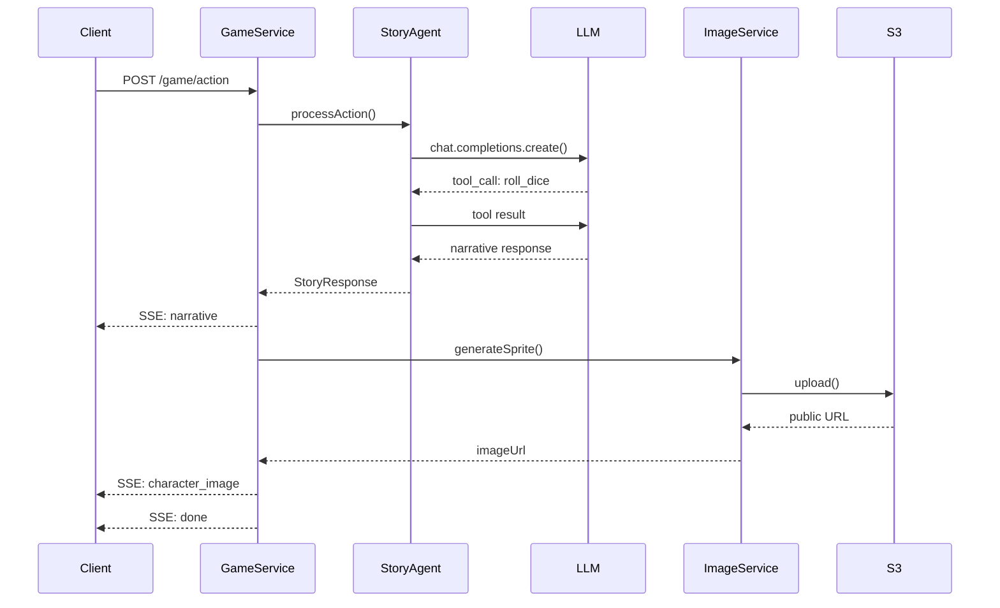
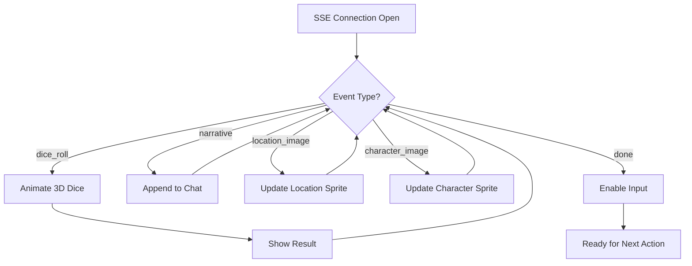
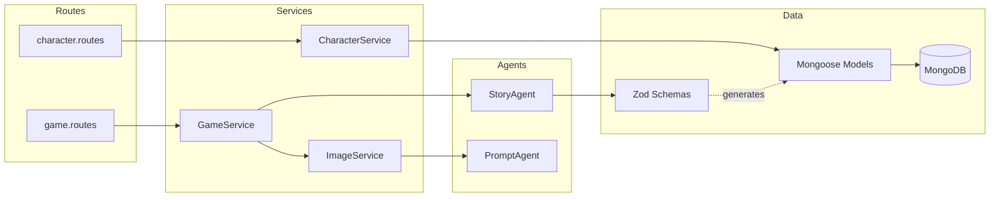

# План написания отчёта о ходе разработки

> **For Claude:** REQUIRED SUB-SKILL: Use superpowers:executing-plans to implement this plan task-by-task.

**Goal:** Написать академический отчёт (5-10 страниц) о разработке AI-powered текстовой RPG для Балтийского научно-инженерного конкурса.

**Architecture:** Последовательное написание секций с анализом исходного кода для извлечения примеров и генерации диаграмм. Каждая секция — отдельный таск.

**Tech Stack:** Markdown, Mermaid диаграммы, русский академический стиль

**Design Doc:** `docs/plans/2025-02-15-development-report-design.md`

---

### Task 1: Создать файл отчёта и написать Введение

**Files:**
- Create: `docs/reports/development-report.md`
- Reference: `src/resources/prompt.yml` (описание сеттинга)

**Step 1: Прочитать prompt.yml для извлечения описания сеттинга**

Найти секцию с описанием игрового мира "Когда упала Рябина".

**Step 2: Написать введение**

```markdown
# Разработка AI-powered текстовой RPG «Когда упала Рябина»

## 1. Введение

[Актуальность: AI в игровой индустрии, процедурная генерация]

[Цель проекта: создание текстовой RPG с динамической генерацией]

[Описание сеттинга из prompt.yml]

[Обзор структуры отчёта]
```

**Step 3: Commit**

```bash
git add docs/reports/development-report.md
git commit -m "docs: add introduction section to development report"
```

---

### Task 2: Написать секцию "Технологический стек"

**Files:**
- Modify: `docs/reports/development-report.md`
- Reference: `package.json` (зависимости)
- Reference: `src/server.ts` (структура приложения)

**Step 1: Проанализировать package.json**

Извлечь версии: express, mongoose, zod, openai, @3d-dice/dice-box, three.

**Step 2: Написать секцию с таблицей технологий**

Включить:
- Бэкенд технологии (Node.js, Express, TypeScript, MongoDB, Zod)
- Фронтенд технологии (Vanilla JS, Three.js, SSE)
- Внешние сервисы (LLM API, Nano Banana, S3)

**Step 3: Создать Mermaid диаграмму технологического стека**



**Step 4: Commit**

```bash
git commit -am "docs: add tech stack section with diagram"
```

---

### Task 3: Написать секцию "Разработка бэкенда" — Архитектура и Агенты

**Files:**
- Modify: `docs/reports/development-report.md`
- Reference: `src/agents/StoryAgent.ts`
- Reference: `src/agents/PromptAgent.ts`
- Reference: `src/services/ChatCompletionService.ts`

**Step 1: Проанализировать структуру агентов**

Прочитать StoryAgent.ts и PromptAgent.ts для понимания системы агентов.

**Step 2: Написать подсекции 3.1-3.2**

- 3.1 Архитектура (монолит, слои, KISS)
- 3.2 Система агентов (StoryAgent, PromptAgent, tool calls)

**Step 3: Извлечь пример кода из ChatCompletionService.ts**

Найти цикл обработки tool calls (while-loop).

**Step 4: Commit**

```bash
git commit -am "docs: add backend architecture and agents section"
```

---

### Task 4: Написать секцию "Разработка бэкенда" — Сложности

**Files:**
- Modify: `docs/reports/development-report.md`
- Reference: `src/services/GameService.ts` (SSE, equipmentHash)
- Reference: `src/services/ImageService.ts` (S3 интеграция)
- Reference: `src/schemas/` (Zod схемы)

**Step 1: Проанализировать GameService.ts**

Найти:
- equipmentHash логику
- SSE event emission

**Step 2: Проанализировать ImageService.ts**

Найти S3 upload логику (следствие ограничений Nano Banana).

**Step 3: Написать подсекции 3.3-3.5**

- 3.3 Таблица ключевых сложностей с решениями
- 3.4 SSE-стриминг
- 3.5 Интеграция с сервисом генерации (проблема mime → S3)

Включить примеры кода.

**Step 4: Создать Sequence diagram потока обработки действия**



**Step 5: Commit**

```bash
git commit -am "docs: add backend challenges section with sequence diagram"
```

---

### Task 5: Написать секцию "Разработка фронтенда"

**Files:**
- Modify: `docs/reports/development-report.md`
- Reference: `public/html/game.html`
- Reference: `public/html/create-character.html`

**Step 1: Проанализировать game.html**

Найти:
- SSE EventSource обработку
- Интеграцию @3d-dice/dice-box
- Обработку событий (dice_roll, narrative, images, done)

**Step 2: Написать подсекции 4.1-4.4**

- 4.1 Архитектурное решение (Vanilla JS, обоснование)
- 4.2 Таблица компонентов
- 4.3 Таблица сложностей (синхронизация дайсов, SSE события)
- 4.4 Интеграция Three.js

Включить примеры кода SSE обработки.

**Step 3: Создать Flowchart обработки SSE событий**



**Step 4: Commit**

```bash
git commit -am "docs: add frontend development section with flowchart"
```

---

### Task 6: Написать секцию "Интеграция компонентов"

**Files:**
- Modify: `docs/reports/development-report.md`
- Reference: `src/schemas/hero.schema.ts`
- Reference: `src/schemas/storyResponse.schema.ts`
- Reference: `src/routes/game.routes.ts`

**Step 1: Проанализировать схемы**

Показать цепочку: Zod → Type → Mongoose Model.

**Step 2: Написать подсекции 5.1-5.4**

- 5.1 Потоки данных (полный цикл)
- 5.2 Схема данных (Zod как источник правды)
- 5.3 Таблица интеграционных сложностей
- 5.4 API-контракт

**Step 3: Создать Component diagram**



**Step 4: Commit**

```bash
git commit -am "docs: add integration section with component diagram"
```

---

### Task 7: Написать Заключение

**Files:**
- Modify: `docs/reports/development-report.md`

**Step 1: Написать подсекции 6.1-6.4**

- 6.1 Достигнутые результаты (список функций)
- 6.2 Принятые инженерные решения (обоснование)
- 6.3 Экономическая целесообразность (стоимость генерации, ожидание)
- 6.4 Перспективы развития

**Step 2: Финальный коммит**

```bash
git commit -am "docs: complete development report with conclusion"
```

---

### Task 8: Ревью и финализация

**Files:**
- Modify: `docs/reports/development-report.md`

**Step 1: Проверить**

- Все диаграммы рендерятся корректно
- Примеры кода синтаксически верны
- Академический стиль соблюдён
- Объём соответствует 5-10 страницам

**Step 2: Исправить найденные проблемы**

**Step 3: Финальный коммит**

```bash
git commit -am "docs: finalize development report"
```

---

## Указания по стилю

**Академический русский:**
- Пассивный залог: "была реализована", "было принято решение"
- Избегать: "мы сделали", "я написал"
- Технические термины на английском: SSE, API, LLM, tool calls, hash

**Примеры кода:**
- Только релевантные фрагменты (10-30 строк)
- С комментариями на русском
- Подсветка синтаксиса (typescript, javascript)

**Диаграммы:**
- Mermaid формат
- Подписи на английском (для читаемости кода)
- Описание на русском в тексте