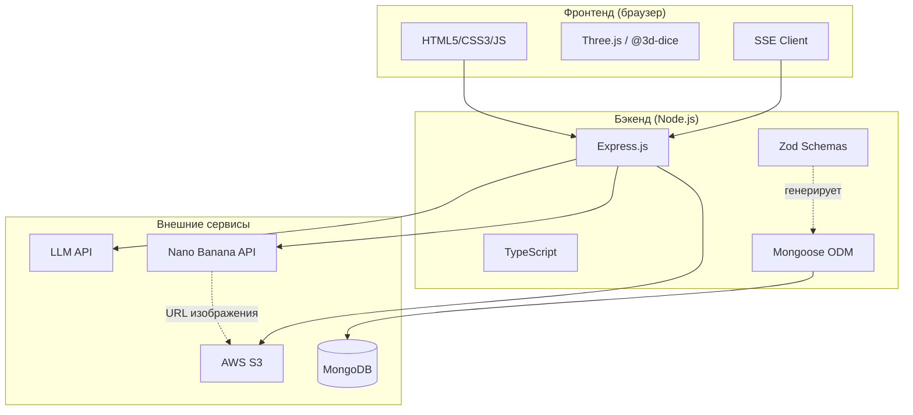
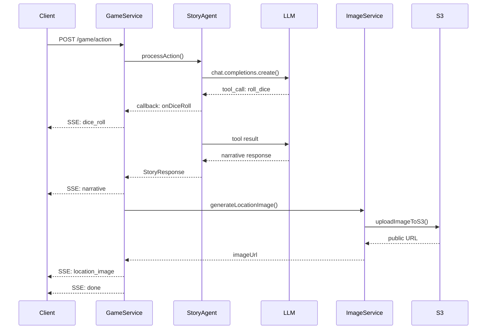
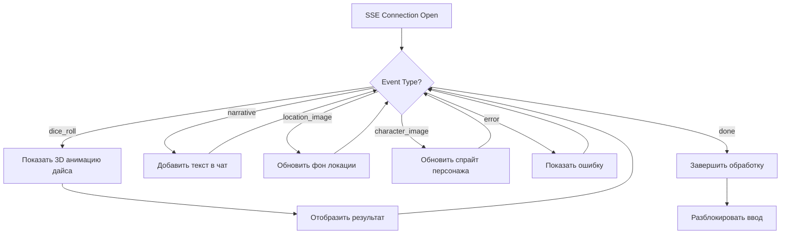
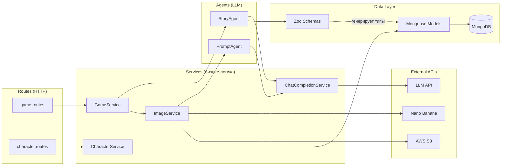

# Разработка AI-powered текстовой RPG «Когда упала Рябина»

## 1. Введение

### 1.1 Актуальность темы

В последние годы технологии искусственного интеллекта находят всё более широкое применение в игровой индустрии. Процедурная генерация контента (Procedural Content Generation, PCG) позволяет создавать уникальный игровой опыт для каждого игрока, а большие языковые модели (Large Language Models, LLM) открывают возможности для динамического построения нарратива, адаптирующегося к действиям пользователя в реальном времени.

Текстовые RPG представляют собой особую нишу, где потенциал AI-генерации раскрывается наиболее полно: отсутствие жёстких графических ограничений позволяет модели создавать неограниченное разнообразие сюжетных ситуаций, персонажей и локаций.

### 1.2 Цель проекта

Целью данного проекта является создание текстовой ролевой игры с динамической генерацией нарратива и визуального контента. Система должна обеспечивать:

- Генерацию связного игрового повествования на основе действий игрока
- Поддержку механик настольных RPG (броски дайсов, проверки характеристик)
- Динамическое создание изображений персонажей и локаций
- Сохранение игрового прогресса и состояния мира

### 1.3 Игровой сеттинг

Действие игры разворачивается в оригинальном фэнтезийном мире «Когда упала Рябина» — постапокалиптическом сеттинге, сочетающем элементы славянской мифологии и классического фэнтези.

Согласно лору игры, у подножия вулкана Потухшая Игнира (известного как «Гора Пепла») росла священная рябина Аш-Карна, чьи ягоды удерживали подземный огонь в состоянии покоя. Когда последняя ягода рассыпалась в пепел, вулкан пробудился, и по земле поползли Огненные Тени — эманации разрушения. Основной квест приключенцев — восстановить Рябинный Круг и предотвратить окончательное извержение.

Сеттинг предусматривает классическую трёхактовую структуру кампании с возможностью сайд-квестов и свободного исследования мира.

### 1.4 Структура отчёта

В данном отчёте последовательно рассматриваются:
- Технологический стек проекта (раздел 2)
- Разработка серверной части приложения (раздел 3)
- Разработка клиентской части (раздел 4)
- Интеграция компонентов системы (раздел 5)
- Заключение и перспективы развития (раздел 6)

---

## 2. Технологический стек

### 2.1 Обзор технологий

Для реализации проекта был выбран следующий набор технологий:

| Категория | Технология | Версия | Назначение |
|-----------|------------|--------|------------|
| **Бэкенд** | Node.js | 20.x | Серверная среда выполнения |
| | Express.js | 4.18 | HTTP-фреймворк |
| | TypeScript | 5.x | Статическая типизация |
| | MongoDB | 8.x | Документоориентированная БД |
| | Mongoose | 8.0 | ODM для MongoDB |
| | Zod | 3.23 | Валидация данных |
| | OpenAI SDK | 6.0 | Интеграция с LLM API |
| **Фронтенд** | Vanilla JS | ES2022 | Клиентская логика |
| | Three.js | via @3d-dice | 3D-визуализация |
| | Canvas API | — | Отрисовка спрайтов |
| | SSE | — | Real-time стриминг |
| **Внешние сервисы** | LLM API | — | Генерация нарратива |
| | Nano Banana API | — | Генерация изображений |
| | AWS S3 | — | Хранение изображений |

### 2.2 Обоснование выбора

**Node.js + Express** были выбраны как зрелая и хорошо документированная платформа для построения HTTP API. TypeScript обеспечивает статическую типизацию, критически важную для поддержки сложных структур игровых данных.

**MongoDB** была выбрана благодаря гибкости документоориентированной модели — игровые сущности (персонажи, локации, предметы) имеют вложенную структуру, которая естественно отображается в JSON-документы.

**Zod** выступает в роли единого источника правды для схем данных: из Zod-схем автоматически генерируются TypeScript-типы и Mongoose-модели через библиотеку `@zodyac/zod-mongoose`.

**Vanilla JavaScript** на фронтенде — осознанный выбор в пользу простоты. Отсутствие build-процесса и фреймворковых абстракций ускорило разработку и упростило отладку.

### 2.3 Архитектурная диаграмма



---

## 3. Разработка бэкенда

### 3.1 Архитектура приложения

Для проекта была выбрана монолитная архитектура. Данное решение обосновывается следующими факторами:

- **Масштаб проекта**: учебный проект не требует горизонтального масштабирования
- **Простота разработки**: единая кодовая база упрощает отладку и развёртывание
- **KISS-принцип**: избыточная сложность микросервисов не оправдана для данной задачи

Приложение организовано в слоистую архитектуру:

```
Routes → Services → Agents → Models
```

Где:
- **Routes** — HTTP-эндпоинты, маршрутизация запросов
- **Services** — бизнес-логика, оркестрация
- **Agents** — взаимодействие с LLM, обработка tool calls
- **Models** — работа с базой данных

Был осознанно принят отказ от DI-контейнеров (Dependency Injection) в пользу прямой инстанциации сервисов в точке входа приложения (`server.ts`). Это упрощает понимание потока зависимостей и соответствует принципу KISS.

### 3.2 Система агентов

Ключевым архитектурным решением является выделение взаимодействия с LLM в отдельный слой «агентов». В системе реализованы два агента:

**StoryAgent** — основной агент, отвечающий за генерацию игрового нарратива. Его задачи:
- Формирование промпта с контекстом игры (персонаж, локация, история)
- Обработка tool calls для механик D&D (броски дайсов)
- Валидация ответа LLM через Zod-схему

**PromptAgent** — вспомогательный агент для генерации промптов к сервису изображений:
- Создание промптов для спрайтов персонажей
- Создание промптов для изображений локаций на основе нарратива

#### Пример: обработка tool calls в StoryAgent

```typescript
// src/agents/StoryAgent.ts
const handler: ToolHandler = async (name, args) => {
  switch (name) {
    case "roll_dice": {
      const { dice_type, count } = RollDiceToolCallSchema.parse(args);
      const result = await this.diceService.throwDice(dice_type, count || 1);
      if (onDiceRoll) {
        const diceString = await this.diceService.getDiceString(dice_type, 1);
        onDiceRoll(diceString, count || 1, result.result);
      }
      return result;
    }
    default:
      throw new Error(`Unknown tool: ${name}`);
  }
};
```

Агент передаёт callback `onDiceRoll`, который позволяет GameService отправлять SSE-события о бросках дайсов клиенту до получения финального нарратива.

#### Цикл обработки tool calls

Особенностью взаимодействия с LLM является возможность множественных tool calls в рамках одного запроса. Например, LLM может запросить несколько бросков дайсов для разных проверок.

Для обработки этого сценария в `ChatCompletionService` реализован цикл:

```typescript
// src/services/ChatCompletionService.ts
async send(
  params: ChatRequestParams,
  toolHandler?: ToolHandler,
  maxIterations: number = 10,
): Promise<string> {
  return retry(async () => {
    const first = await this.openai.chat.completions.create(params);
    let message = first.choices[0].message;
    let iterations = 0;
    params.messages.push(message);
    let currentParams = params;

    // Цикл обработки tool calls
    while (
      message.tool_calls &&
      message.tool_calls.length > 0 &&
      iterations < maxIterations
    ) {
      const { nextMessage, nextParams } =
        await this.processCompletionWithTools(
          currentParams,
          message.tool_calls,
          toolHandler,
        );
      message = nextMessage;
      currentParams = nextParams;
      iterations++;
    }

    return message?.content?.toString() || "";
  }, { retries: 3, minTimeout: 500 });
}
```

Цикл продолжается до тех пор, пока LLM возвращает tool calls, с защитой от бесконечного цикла через `maxIterations`. Дополнительно реализован механизм retry с экспоненциальным backoff для обработки временных сбоев API.

### 3.3 Ключевые технические сложности

В ходе разработки серверной части были решены следующие технические задачи:

| Проблема | Решение |
|----------|---------|
| Структурированные ответы от LLM | Zod-схемы + `response_format: json_schema` |
| Множественные tool calls (дайсы могут вызываться несколько раз) | While-loop с аккумуляцией результатов в `ChatCompletionService` |
| Оптимизация генерации спрайтов | `equipmentHash` — перегенерация только при изменении экипировки |
| Единый источник правды для типов | Zod → TypeScript types + Mongoose models |
| Ограничения Nano Banana API | Интеграция с AWS S3 для передачи публичных URL |

### 3.4 SSE-стриминг

Особую сложность представляла реализация Server-Sent Events (SSE) для передачи множественных асинхронных событий клиенту. В процессе обработки одного действия игрока генерируются события различных типов:

```typescript
// src/services/GameService.ts
export type SSEEvent =
  | { type: "dice_roll"; dice: string; count: number; result: number }
  | { type: "narrative"; narrative: string; location: string; locationDescription: string }
  | { type: "location_image"; url: string }
  | { type: "character_image"; url: string }
  | { type: "error"; message: string }
  | { type: "done" };
```

Для упорядоченной отправки событий `GameService` принимает callback-функцию `emit`, которая вызывается по мере готовности каждого типа данных:

```typescript
// src/routes/game.routes.ts
await gameService.processPlayerActionSSE(characterId, action, (event) => {
  res.write(`data: ${JSON.stringify(event)}\n\n`);
});

res.write(`data: ${JSON.stringify({ type: 'done' })}\n\n`);
res.end();
```

Порядок событий детерминирован: `dice_roll` → `narrative` → `location_image` → `character_image` → `done`. Это позволяет клиенту корректно обновлять UI в ожидаемой последовательности.

### 3.5 Интеграция с сервисом генерации изображений

При интеграции с Nano Banana API было обнаружено архитектурное ограничение: API не поддерживало передачу референсных изображений в формате base64/mime inline. Это потребовало изменения первоначального плана.

**Изначальный план:** передача изображения персонажа напрямую в API для генерации локации с персонажем.

**Обнаруженное ограничение:** API принимает только публичные URL изображений.

**Принятое решение:** интеграция с AWS S3 для промежуточного хранения:

```typescript
// src/services/ImageService.ts
private async buildMessages(
  prompt: string,
  previousImageUrl: string | undefined = undefined,
): Promise<{ messages: PredictMessage[]; publicImageUrl: string | undefined }> {
  if (!previousImageUrl) {
    return {
      messages: [{ role: "user", content: [{ type: "text", text: prompt }] }],
      publicImageUrl: undefined,
    };
  } else {
    // Загрузка локального изображения в S3 для получения публичного URL
    const publicUrl = decodeURIComponent(
      await uploadImageToS3(
        process.env.S3_BUCKET || "",
        `when-mountain-ash-fell/${decodeURIComponent(previousImageUrl)}`,
        await fs.readFile(previousImageUrl),
        process.env.S3_BUCKET_KEY || "",
      ),
    );
    // Формирование сообщения с публичным URL
    const imageMessage = {
      type: "image_url" as const,
      image_url: { url: publicUrl },
    };
    return {
      messages: [{ role: "user", content: [imageMessage, { type: "text", text: prompt }] }],
      publicImageUrl: publicUrl,
    };
  }
}
```

**Урок:** необходимость раннего прототипирования интеграций с внешними сервисами для выявления ограничений до начала полноценной разработки.

### 3.6 Диаграмма потока обработки действия



---

## 4. Разработка фронтенда

### 4.1 Архитектурное решение

Для клиентской части был осознанно выбран подход без использования JavaScript-фреймворков (React, Vue, Angular). Обоснование:

- **Простота**: отсутствие build-процесса, прямая работа с DOM
- **Контроль**: полное понимание происходящего без фреймворковых абстракций
- **Скорость разработки**: для учебного проекта с ограниченным UI overhead фреймворков не оправдан
- **Образовательная ценность**: работа с нативными Web API (SSE, Canvas, Fetch)

Клиентская часть организована как набор HTML-страниц с подключаемыми JavaScript-файлами:
- `game.html` + `game.js` — основной игровой интерфейс
- `create-character.html` — создание персонажа

### 4.2 Основные компоненты

| Компонент | Технология | Назначение |
|-----------|------------|------------|
| Игровой чат | SSE + DOM manipulation | Real-time отображение нарратива |
| 3D дайсы | Three.js + @3d-dice/dice-box-threejs | Визуализация бросков |
| Спрайты персонажей | Canvas API | Отрисовка сгенерированных изображений |
| Инвентарь | HTML Dialog + динамический рендеринг | Управление экипировкой |
| Фон локации | CSS background-image | Отображение сгенерированных локаций |

### 4.3 Ключевые сложности фронтенда

| Проблема | Решение |
|----------|---------|
| Синхронизация 3D дайсов с серверными бросками | Ожидание события `dice_roll` через SSE, анимация с предопределённым результатом |
| Обработка множественных SSE-событий | Switch-case по `event.type` с последовательным обновлением UI |
| Отзывчивость интерфейса при генерации | Прогрессивное отображение: loading → narrative → images |
| Отслеживание изменений экипировки | Snapshot до/после открытия инвентаря, diff для регенерации спрайта |

### 4.4 Интеграция Three.js и обработка SSE

Библиотека `@3d-dice/dice-box-threejs` требует WebGL-контекста и асинхронной инициализации. Решение — инициализация при загрузке страницы с сохранением инстанса глобально:

```javascript
// public/html/game.html
const Box = new DiceBox("#dice-box", {
    light_intensity: 1,
    gravity_multiplier: 600,
    baseScale: 100,
    strength: 2,
    assetPath: "/assets/",
    theme: "theme-blue-green-metal",
});

Box.initialize().then(() => {
    window.diceBox = Box;
});
```

Обработка SSE-событий реализована через Fetch API с ручным парсингом потока:

```javascript
// public/script/game.js
const response = await fetch('/game/action', {
    method: 'POST',
    headers: {'Content-Type': 'application/json'},
    body: JSON.stringify(body)
});

const reader = response.body.getReader();
const decoder = new TextDecoder();
let buffer = '';

while (true) {
    const {done, value} = await reader.read();
    if (done) break;

    buffer += decoder.decode(value, {stream: true});
    const lines = buffer.split('\n\n');
    buffer = lines.pop();

    for (const line of lines) {
        if (!line.startsWith('data: ')) continue;
        const data = JSON.parse(line.slice(6));

        switch (data.type) {
            case 'dice_roll':
                showDiceRoll(data.dice, data.result);
                break;
            case 'narrative':
                addMessage(data.narrative, false);
                break;
            case 'location_image':
                document.getElementById('locImg').setAttribute('src', data.url);
                break;
            // ...
        }
    }
}
```

Синхронизация дайсов с серверным результатом достигается через специальную нотацию `dice@result`:

```javascript
function showDiceRoll(dice, result) {
    const diceNotation = `${dice}@${result}`;  // например "1d20@15"
    window.diceBox.roll(diceNotation);  // анимация с заранее известным результатом
}
```

### 4.5 Диаграмма обработки SSE-событий



---

## 5. Интеграция компонентов

### 5.1 Потоки данных

Полный цикл обработки действия игрока включает следующие этапы:

1. **Клиент → Сервер**: POST-запрос с действием игрока
2. **Сервер → LLM**: формирование промпта, отправка в API
3. **LLM → Сервер**: tool calls (дайсы), нарратив
4. **Сервер → Клиент**: SSE-события (dice_roll, narrative)
5. **Сервер → Image API**: генерация изображения локации
6. **Image API → S3**: загрузка для получения URL
7. **Сервер → MongoDB**: сохранение состояния
8. **Сервер → Клиент**: SSE-события (location_image, done)

### 5.2 Схема данных: Zod как единый источник правды

Ключевым архитектурным решением является использование Zod-схем как единственного источника определения структур данных. Из схем автоматически выводятся:

- **TypeScript-типы** через `z.infer<typeof Schema>`
- **Mongoose-модели** через `@zodyac/zod-mongoose`
- **JSON Schema** для LLM response_format через `zod-to-json-schema`

Пример цепочки трансформаций:

```typescript
// src/schemas/hero.schema.ts — Zod-схема
export const HeroSchema = z.object({
  _id: z.string(),
  characterName: z.string(),
  age: z.number(),
  race: RaceSchema,
  class: GameClassSchema,
  stats: CharacterStatsSchema,
  inventory: z.array(ItemSchema).optional().default([]),
  equipment: CharacterEquipmentSchema.optional().default({}),
  appearance: z.string(),
  imageUrl: z.string().optional(),
});

// src/types/index.ts — TypeScript-тип (автовывод)
export type Hero = z.infer<typeof HeroSchema>;
```

Преимущество подхода: изменение схемы автоматически обновляет типы во всём приложении, а валидация данных происходит в runtime.

### 5.3 Ключевые интеграционные сложности

| Проблема | Решение |
|----------|---------|
| Согласованность типов между клиентом и сервером | Строгие Zod-схемы для всех API-ответов |
| Порядок событий в SSE | Детерминированная последовательность: dice → narrative → images → done |
| Консистентность игрового состояния | Атомарное обновление в MongoDB после успешной генерации нарратива |
| Отслеживание изменений экипировки | MD5-hash экипировки (`equipmentHash`) для определения необходимости регенерации |

### 5.4 API-контракт

Система предоставляет следующие HTTP-эндпоинты:

| Метод | Путь | Назначение | Формат ответа |
|-------|------|------------|---------------|
| GET | `/game/content` | Статический контент (расы, классы, предметы) | JSON |
| GET | `/game/character/:id` | Данные персонажа | JSON |
| POST | `/game/action` | Обработка действия игрока | SSE stream |
| GET | `/character` | Получение персонажа по ID | JSON |
| POST | `/character` | Создание персонажа | JSON |

Единственный stateful-эндпоинт — `/game/action`, использующий SSE для стриминга результатов.

### 5.5 Диаграмма компонентов системы

