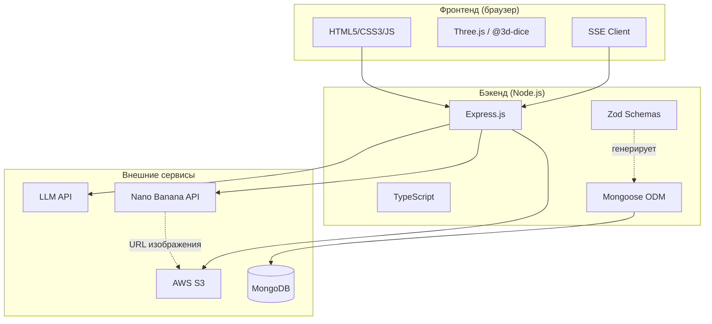

# Разработка AI-powered текстовой RPG «Когда упала Рябина»

## 1. Введение

### 1.1 Актуальность темы

В последние годы технологии искусственного интеллекта находят всё более широкое применение в игровой индустрии. Процедурная генерация контента (Procedural Content Generation, PCG) позволяет создавать уникальный игровой опыт для каждого игрока, а большие языковые модели (Large Language Models, LLM) открывают возможности для динамического построения нарратива, адаптирующегося к действиям пользователя в реальном времени.

Текстовые RPG представляют собой особую нишу, где потенциал AI-генерации раскрывается наиболее полно: отсутствие жёстких графических ограничений позволяет модели создавать неограниченное разнообразие сюжетных ситуаций, персонажей и локаций.

### 1.2 Цель проекта

Целью данного проекта является создание текстовой ролевой игры с динамической генерацией нарратива и визуального контента. Система должна обеспечивать:

- Генерацию связного игрового повествования на основе действий игрока
- Поддержку механик настольных RPG (броски дайсов, проверки характеристик)
- Динамическое создание изображений персонажей и локаций
- Сохранение игрового прогресса и состояния мира

### 1.3 Игровой сеттинг

Действие игры разворачивается в оригинальном фэнтезийном мире «Когда упала Рябина» — постапокалиптическом сеттинге, сочетающем элементы славянской мифологии и классического фэнтези.

Согласно лору игры, у подножия вулкана Потухшая Игнира (известного как «Гора Пепла») росла священная рябина Аш-Карна, чьи ягоды удерживали подземный огонь в состоянии покоя. Когда последняя ягода рассыпалась в пепел, вулкан пробудился, и по земле поползли Огненные Тени — эманации разрушения. Основной квест приключенцев — восстановить Рябинный Круг и предотвратить окончательное извержение.

Сеттинг предусматривает классическую трёхактовую структуру кампании с возможностью сайд-квестов и свободного исследования мира.

### 1.4 Структура отчёта

В данном отчёте последовательно рассматриваются:
- Технологический стек проекта (раздел 2)
- Разработка серверной части приложения (раздел 3)
- Разработка клиентской части (раздел 4)
- Интеграция компонентов системы (раздел 5)
- Заключение и перспективы развития (раздел 6)

---

## 2. Технологический стек

### 2.1 Обзор технологий

Для реализации проекта был выбран следующий набор технологий:

| Категория | Технология | Версия | Назначение |
|-----------|------------|--------|------------|
| **Бэкенд** | Node.js | 20.x | Серверная среда выполнения |
| | Express.js | 4.18 | HTTP-фреймворк |
| | TypeScript | 5.x | Статическая типизация |
| | MongoDB | 8.x | Документоориентированная БД |
| | Mongoose | 8.0 | ODM для MongoDB |
| | Zod | 3.23 | Валидация данных |
| | OpenAI SDK | 6.0 | Интеграция с LLM API |
| **Фронтенд** | Vanilla JS | ES2022 | Клиентская логика |
| | Three.js | via @3d-dice | 3D-визуализация |
| | Canvas API | — | Отрисовка спрайтов |
| | SSE | — | Real-time стриминг |
| **Внешние сервисы** | LLM API | — | Генерация нарратива |
| | Nano Banana API | — | Генерация изображений |
| | AWS S3 | — | Хранение изображений |

### 2.2 Обоснование выбора

**Node.js + Express** были выбраны как зрелая и хорошо документированная платформа для построения HTTP API. TypeScript обеспечивает статическую типизацию, критически важную для поддержки сложных структур игровых данных.

**MongoDB** была выбрана благодаря гибкости документоориентированной модели — игровые сущности (персонажи, локации, предметы) имеют вложенную структуру, которая естественно отображается в JSON-документы.

**Zod** выступает в роли единого источника правды для схем данных: из Zod-схем автоматически генерируются TypeScript-типы и Mongoose-модели через библиотеку `@zodyac/zod-mongoose`.

**Vanilla JavaScript** на фронтенде — осознанный выбор в пользу простоты. Отсутствие build-процесса и фреймворковых абстракций ускорило разработку и упростило отладку.

### 2.3 Архитектурная диаграмма



---

## 3. Разработка бэкенда

### 3.1 Архитектура приложения

Для проекта была выбрана монолитная архитектура. Данное решение обосновывается следующими факторами:

- **Масштаб проекта**: учебный проект не требует горизонтального масштабирования
- **Простота разработки**: единая кодовая база упрощает отладку и развёртывание
- **KISS-принцип**: избыточная сложность микросервисов не оправдана для данной задачи

Приложение организовано в слоистую архитектуру:

```
Routes → Services → Agents → Models
```

Где:
- **Routes** — HTTP-эндпоинты, маршрутизация запросов
- **Services** — бизнес-логика, оркестрация
- **Agents** — взаимодействие с LLM, обработка tool calls
- **Models** — работа с базой данных

Был осознанно принят отказ от DI-контейнеров (Dependency Injection) в пользу прямой инстанциации сервисов в точке входа приложения (`server.ts`). Это упрощает понимание потока зависимостей и соответствует принципу KISS.

### 3.2 Система агентов

Ключевым архитектурным решением является выделение взаимодействия с LLM в отдельный слой «агентов». В системе реализованы два агента:

**StoryAgent** — основной агент, отвечающий за генерацию игрового нарратива. Его задачи:
- Формирование промпта с контекстом игры (персонаж, локация, история)
- Обработка tool calls для механик D&D (броски дайсов)
- Валидация ответа LLM через Zod-схему

**PromptAgent** — вспомогательный агент для генерации промптов к сервису изображений:
- Создание промптов для спрайтов персонажей
- Создание промптов для изображений локаций на основе нарратива

#### Пример: обработка tool calls в StoryAgent

```typescript
// src/agents/StoryAgent.ts
const handler: ToolHandler = async (name, args) => {
  switch (name) {
    case "roll_dice": {
      const { dice_type, count } = RollDiceToolCallSchema.parse(args);
      const result = await this.diceService.throwDice(dice_type, count || 1);
      if (onDiceRoll) {
        const diceString = await this.diceService.getDiceString(dice_type, 1);
        onDiceRoll(diceString, count || 1, result.result);
      }
      return result;
    }
    default:
      throw new Error(`Unknown tool: ${name}`);
  }
};
```

Агент передаёт callback `onDiceRoll`, который позволяет GameService отправлять SSE-события о бросках дайсов клиенту до получения финального нарратива.

#### Цикл обработки tool calls

Особенностью взаимодействия с LLM является возможность множественных tool calls в рамках одного запроса. Например, LLM может запросить несколько бросков дайсов для разных проверок.

Для обработки этого сценария в `ChatCompletionService` реализован цикл:

```typescript
// src/services/ChatCompletionService.ts
async send(
  params: ChatRequestParams,
  toolHandler?: ToolHandler,
  maxIterations: number = 10,
): Promise<string> {
  return retry(async () => {
    const first = await this.openai.chat.completions.create(params);
    let message = first.choices[0].message;
    let iterations = 0;
    params.messages.push(message);
    let currentParams = params;

    // Цикл обработки tool calls
    while (
      message.tool_calls &&
      message.tool_calls.length > 0 &&
      iterations < maxIterations
    ) {
      const { nextMessage, nextParams } =
        await this.processCompletionWithTools(
          currentParams,
          message.tool_calls,
          toolHandler,
        );
      message = nextMessage;
      currentParams = nextParams;
      iterations++;
    }

    return message?.content?.toString() || "";
  }, { retries: 3, minTimeout: 500 });
}
```

Цикл продолжается до тех пор, пока LLM возвращает tool calls, с защитой от бесконечного цикла через `maxIterations`. Дополнительно реализован механизм retry с экспоненциальным backoff для обработки временных сбоев API.